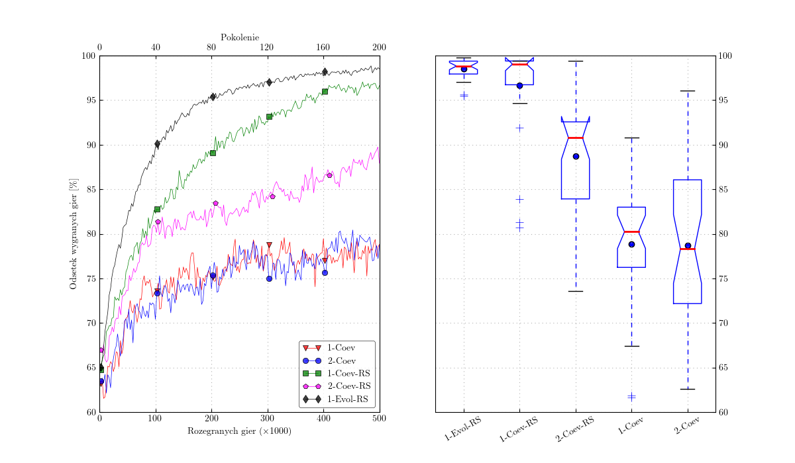

# README

## Script Overview

This script is designed to generate a plot that replicates the visual representation found in the file `goal.png`. The script reads input data, processes it, and produces a plot that closely matches the goal plot.

## This image represents the target plot that the script is attempting to replicate.  
  
## This image shows the plot generated by the script.
  
